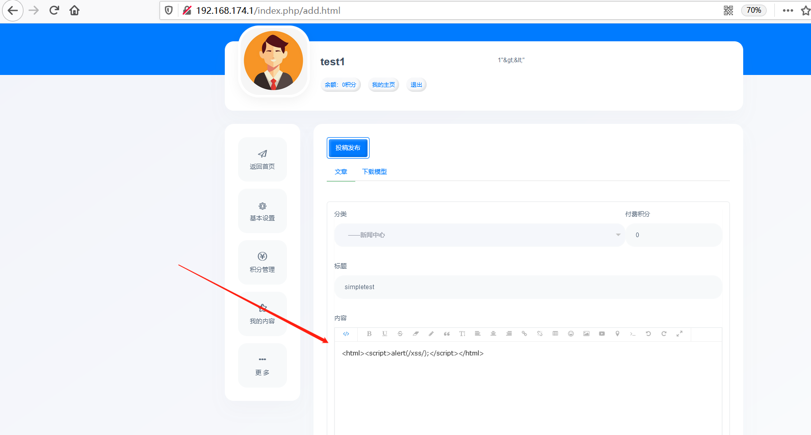
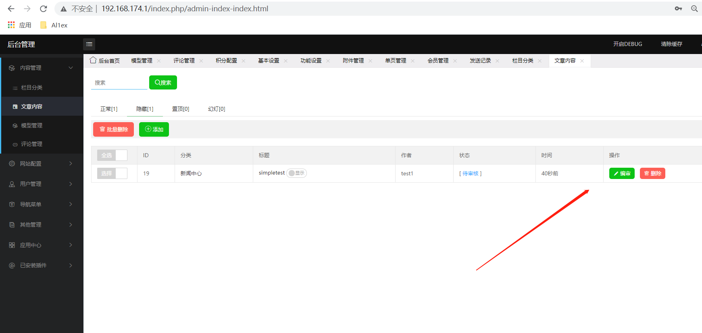
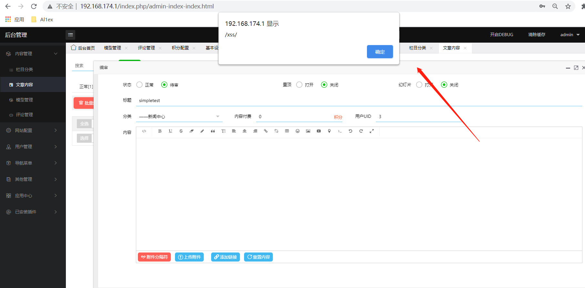

## Information

```c
Exploit Title:115CMS-v4.05-Cross Site Scripting(XSS)
Exploit date:25.05.2021
Exploit Author:Al1ex@Heptagram
Vendor Homepage:https://www.115cms.com/
Affect Version:v4.05
Description:There is an XSS vulnerability in 115CMS-v4.05. Attackers can steal users' cookies and other information by constructing malicious request packets
```

## How to Exploit

Use test1 to log in and contribute, and insert malicious XSS code into the manuscript information.



The malicious XSS code can be successfully triggered when the administrator user views the contribution information.





## Reference

https://www.115cms.com/
