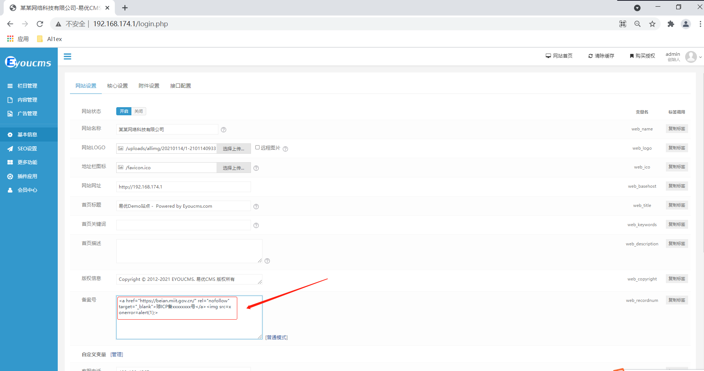
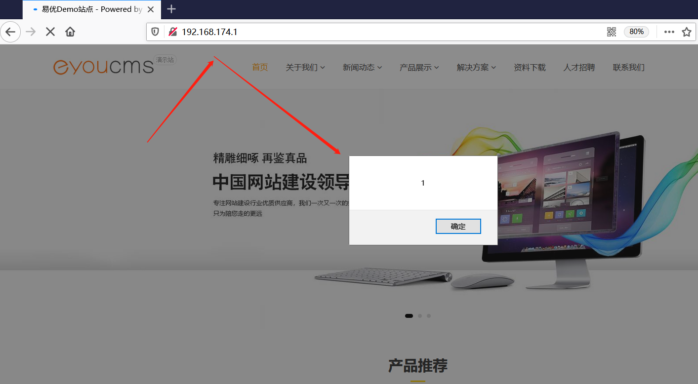

## Information

```c
Exploit Title:EyouCMS-V1.5.3-UTF8-SP3_001-Cross Site Scripting(XSS)
Exploit date:26.05.2021
Exploit Author:Al1ex@Heptagram
Vendor Homepage:https://www.eyoucms.com/
Affect Version:V1.5.3
Description:There is an XSS vulnerability in EyouCMS-V1.5.3-UTF8-SP3_001. Attackers can steal users' cookies and other information by constructing malicious request packets
```

## How to Exploit

Insert malicious XSS code in the record number, and then save and submit



After that, when the user visits the home page, the malicious XSS code can be triggered successfully



## Reference

https://www.eyoucms.com/
