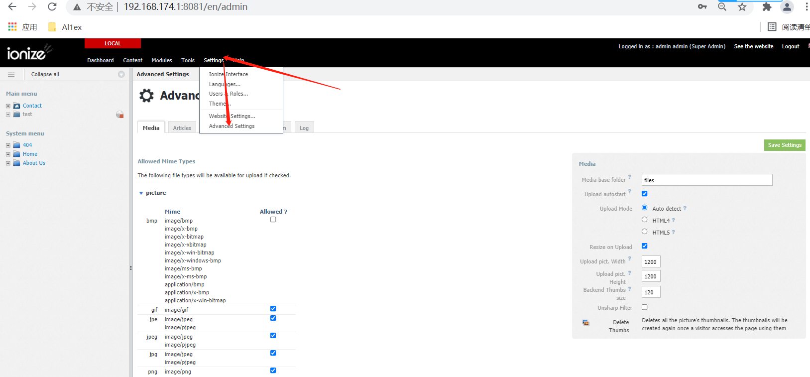
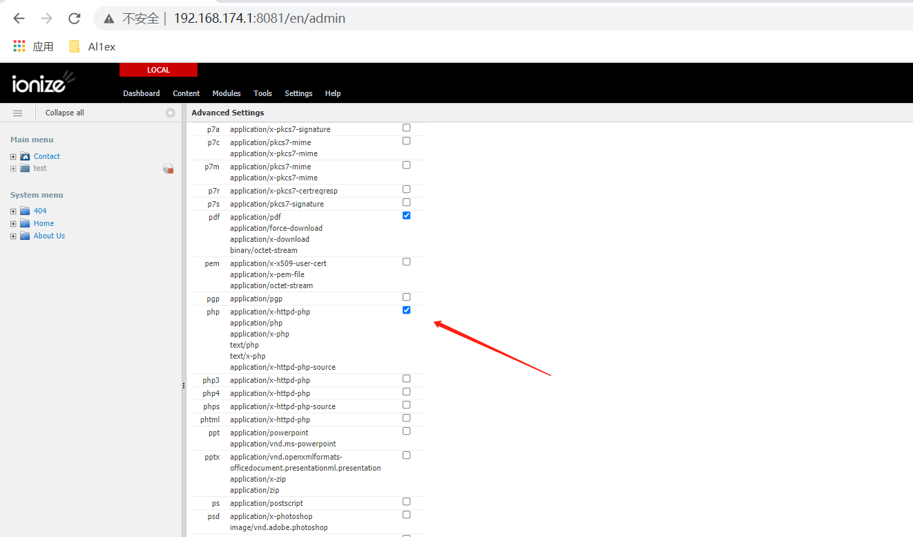
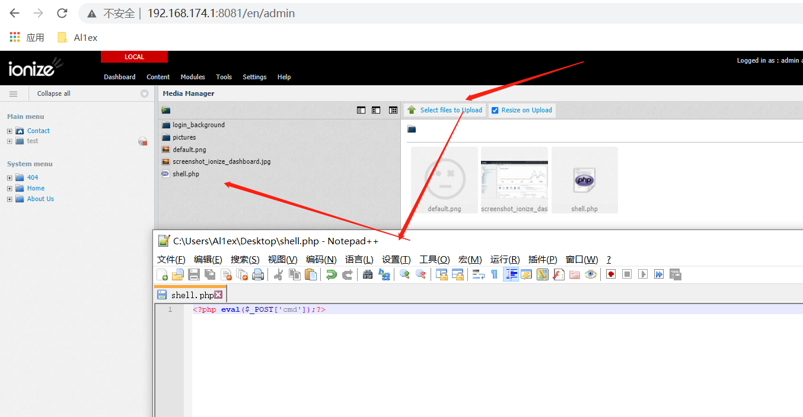
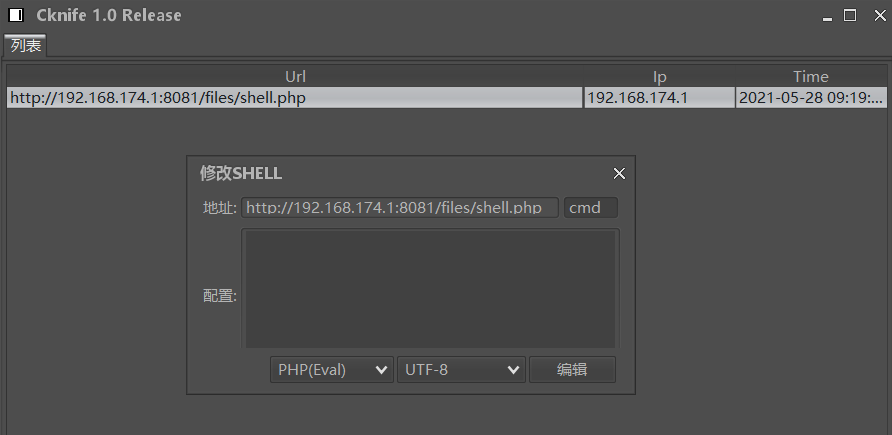
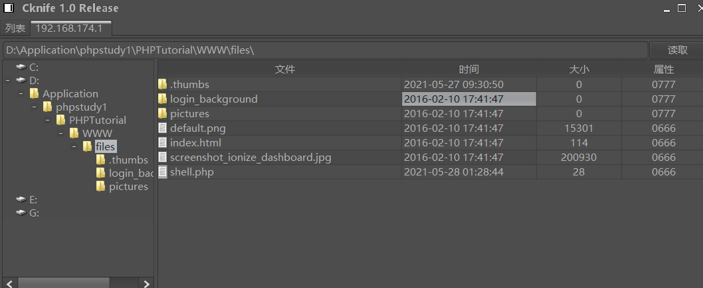

## Information

```c
Exploit Title:IonizeCMS-V1.0.8.1-Background file upload causes getshell
Exploit date:28.05.2021
Exploit Author:Al1ex@Heptagram
Vendor Homepage:https://github.com/ionize/ionize
Affect Version:V1.0.8.1
Description:The background of ionizecms can configure the format of the uploaded files, and provide the function module of uploading files. Attackers can upload malicious files and get shell by combining the above two functions
```

## How to Exploit

First, log in to the background, select advanced settings and support uploading PHP files





Then go to dashborad and select media to upload the file



Then use the knife to link the shell





## Reference

https://github.com/ionize/ionize


