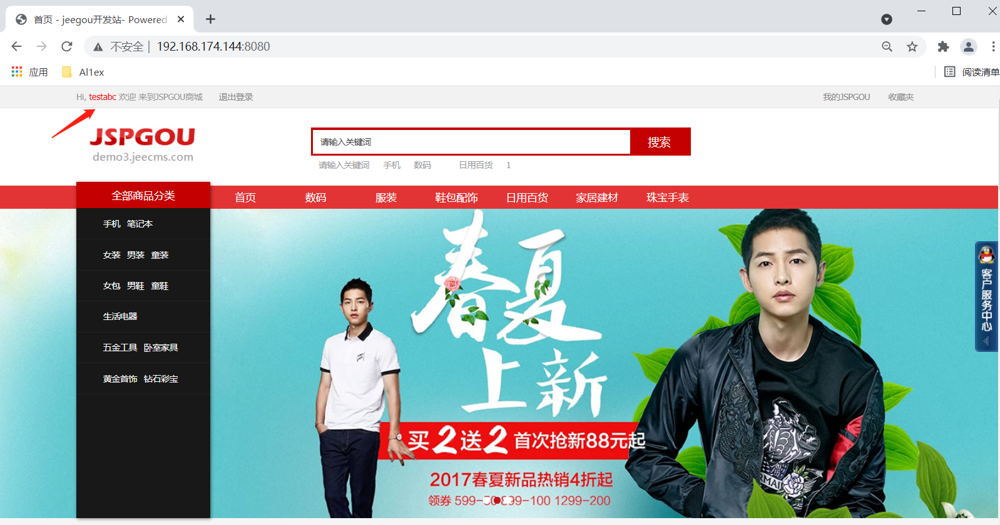
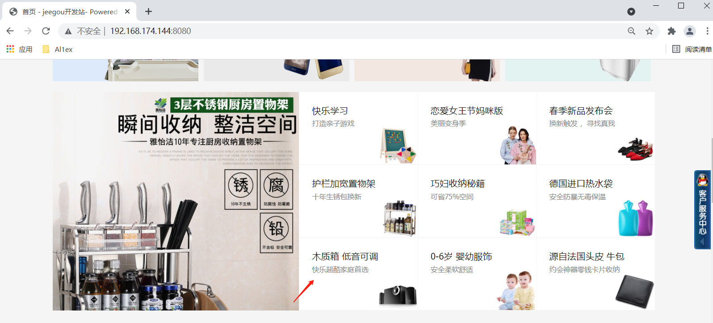
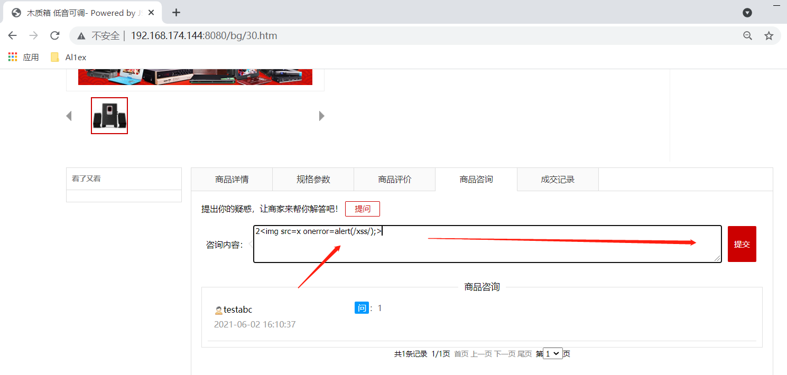
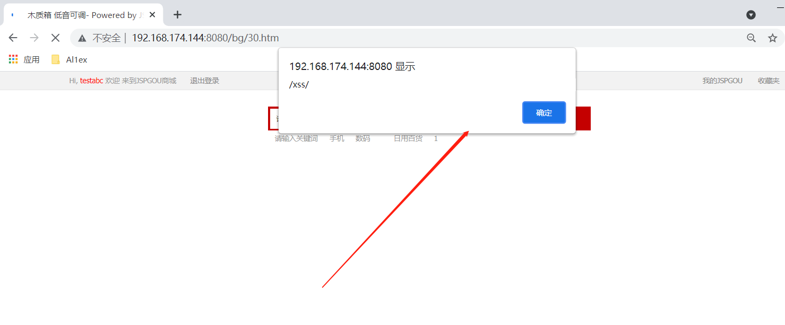

## Information

```c
Exploit Title:JSPGOU v6.0-Cross Site Scripting(XSS)
Exploit date:02.06.2021
Exploit Author:Al1ex@Heptagram
Vendor Homepage:https://www.jeecms.com/
Affect Version:JSPGOU v6.0
Description:There is an XSS vulnerability in jspgou foreground commodity consultation function module. The attacker can steal the cookie information of any user through this vulnerability.
```

## How to Exploit

Step  1：register a user and login in



Step 2：Select any product and enter the introduction page



Step 3：insert malicious XSS code at the commodity consultation

```
2
```



When other users view product information, malicious XSS can be triggered successfully



## Reference

https://www.jeecms.com/

