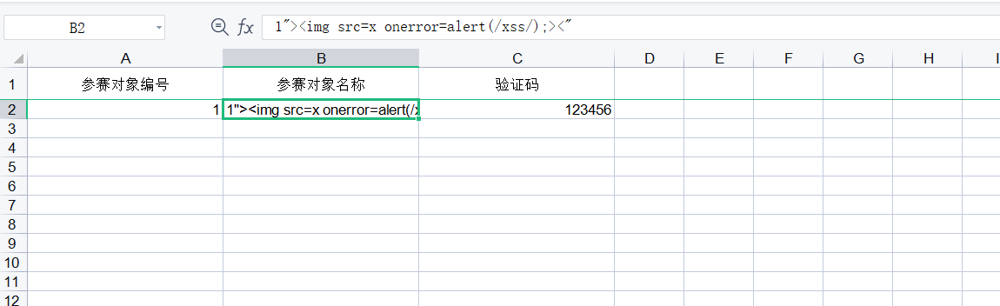
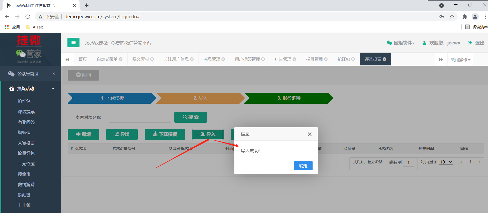
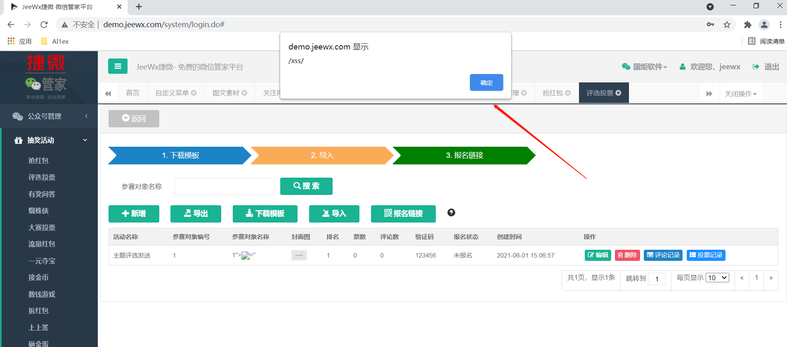

## Information

```c
Exploit Title:Jeewx-Boot-v1.3-Storage XSS
Exploit date:01.06.2021
Exploit Author:Al1ex@Heptagram
Vendor Homepage:https://github.com/zhangdaiscott/jeewx-boot
Affect Version:Jeewx-Boot-v1.3
Description:The background voting function module of jeewx-boot-v1.3 allows users to import data through templates, but does not filter the data strictly. An attacker can construct an excel with massive data and insert a malicious payload, and then cheat the administrator to import the Excel to trigger malicious XSS code.
```

## How to Exploit

Step 1：download templates

Step 2：Insert malicious payload into template



Step 3：Then cheat the administrator to import the template application



The malicious payload was successfully executed



## Reference

https://github.com/zhangdaiscott/jeewx-boot

