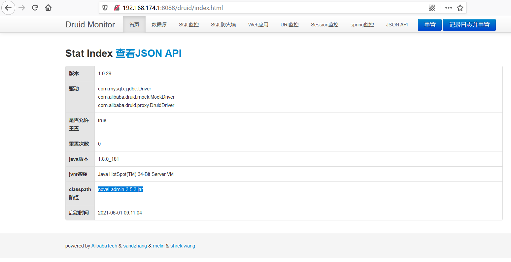
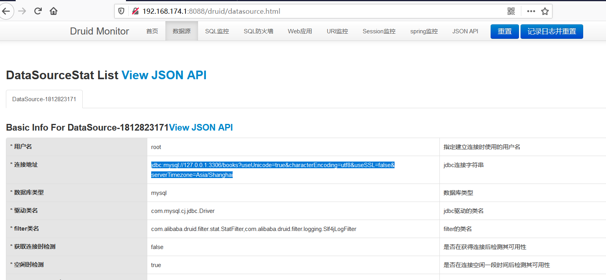
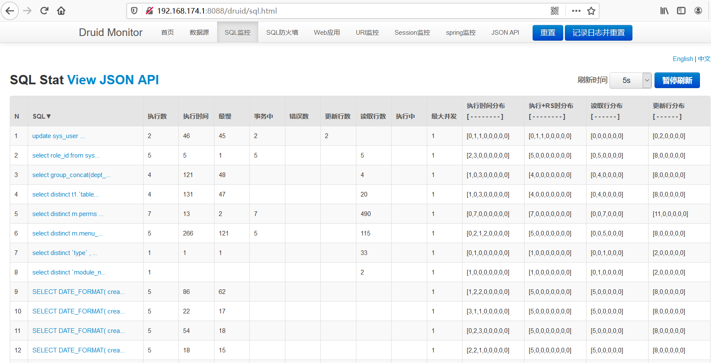
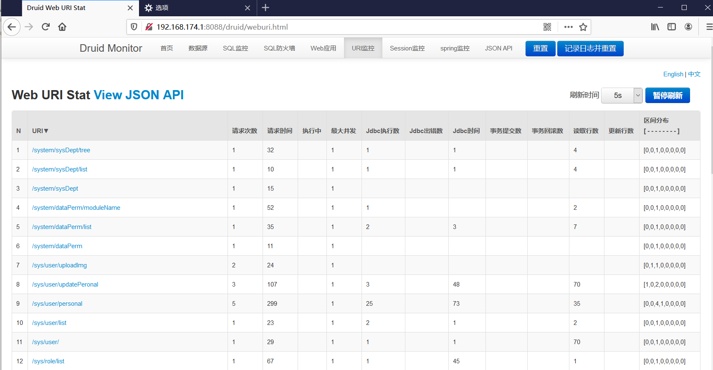
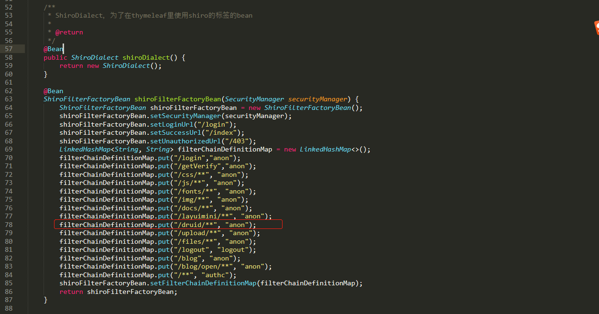

## Information

```c
Exploit Title:novel-plus-install-v3.5.3-Druid Unauthorized access
Exploit date:01.06.2021
Exploit Author:Al1ex@Heptagram
Vendor Homepage:https://github.com/201206030/novel-plus
Affect Version:novel-plus-install-v3.5.3
Description:Novell plus system carries Druid component, and the permission check is verified by Shiro. However, Shiro has wrong configuration when checking permission, which leads to unauthorized access of Druid in Novell plus. Attackers can use this vulnerability to obtain sensitive information, such as database link address, database user name, valid session information, etc.
```

## How to Exploit

**Step 1：After setting up the Novell plus environment, visit the following connections**

http://192.168.174.1:8088/druid/index.html









## Code Analysis

novel-plus-3.5.3\novel-admin\src\main\java\com\java2nb\common\config\ShiroConfig.java

Anon here means to allow any user to access, while authc needs to check the permissions. You can see that Druid has unauthorized access.



## Reference

https://github.com/201206030/novel-plus

