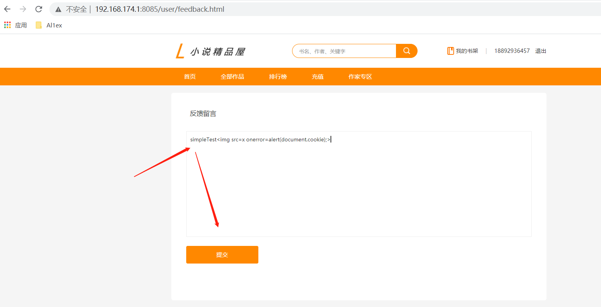
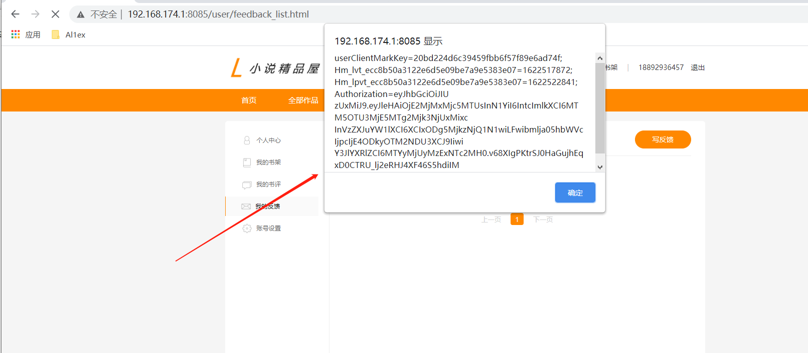
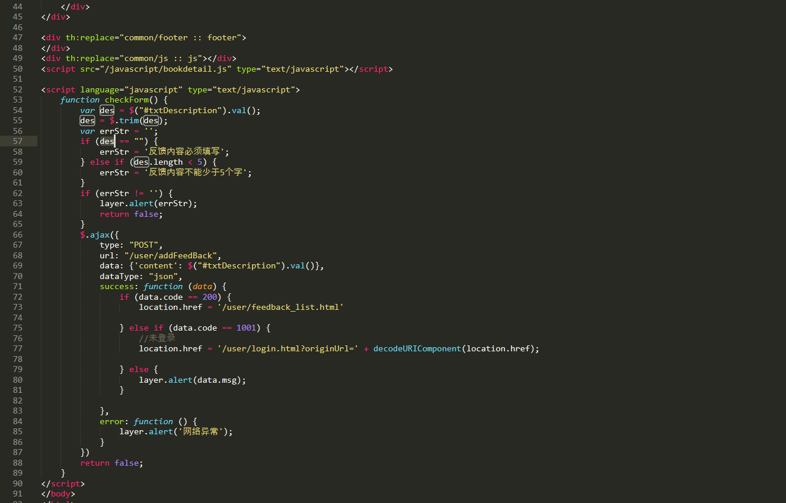
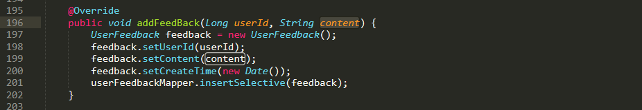
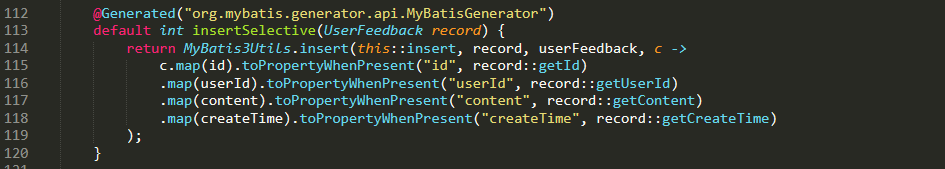

## Information

```c
Exploit Title:Novel-plus-install-v3.5.3-Storage XSS
Exploit date:01.06.2021
Exploit Author:Al1ex@Heptagram
Vendor Homepage:https://github.com/201206030/novel-plus
Affect Version:novel-plus-install-v3.5.3
Description:Novell plus feedback message function module has storage XSS, which can be used by attackers to steal users' cookie information.
```

## How to Exploit

Step 1：register a user

Step 2：Sign in

Step 3：Access feedback message function module and insert malicious XSS

```
simpleTest
```





Malicious XSS code will be successfully triggered when there is management check feedback

## Code Analysis

novel-plus-3.5.3\novel-front\src\main\resources\templates\user\feedback.html



novel-plus-3.5.3\novel-front\src\main\java\com\java2nb\novel\service\impl\UserServiceImpl.java





## Reference

https://github.com/201206030/novel-plus
